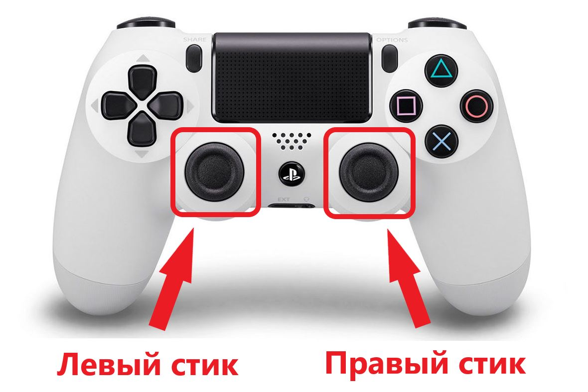

# Управление Pioneer mini с джойстика
## Описание файлов:
###Joystick.py
Класс для обработки сигналов с джойстика.
На данный момент реализовано управление с помощью следующих джойстиков:
* Dualshock 4
* Controller Xbox 360

Считывание управляющих сигналов осуществляется с помощью библиотеки [pygame](https://www.pygame.org/docs/)

###joy_control.py
Скрипт использует класс Joystick для получения значения осей и отправки их на коптер.

## Начало работы:
* Скачать библиотеку [pioneer_sdk](https://github.com/geoscan/pioneer_sdk) и установить необходимые пакеты (внутри есть описание)
* Поместить файлы joy_control.py и Joystick.py  один проект с [pioneer_sdk](https://github.com/geoscan/pioneer_sdk)
* Подключить джойстик к компьютеру
* Подключить Pioneer mini по wifi к компьютеру
* Запустить скрипт joy_control.py

## Пример управления
Управление осуществляется с помощью стиков:

Левый стик испольщзуется для перемещения коптера в плоскости.

Правый стик используется для изменения высоты (стик вперед-назад) и для изменения угла поворота (влево-вправо)
